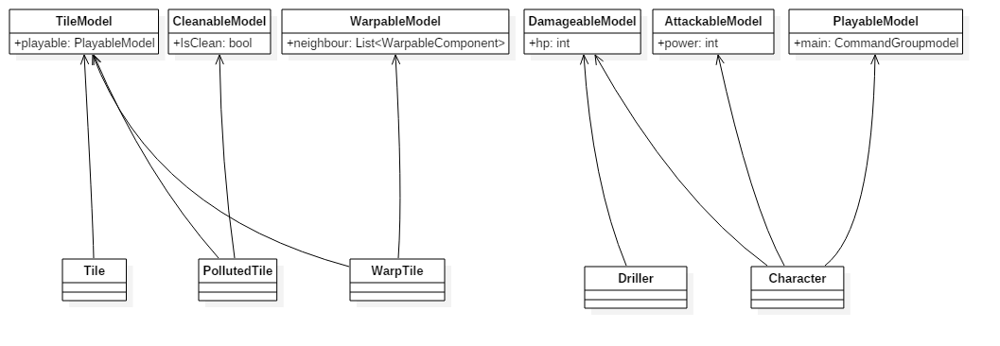
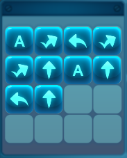

# PuzzlePlay design overview

## 개요

- PuzzleCoding내에는 퍼즐 스테이지가 있고 명령어를 통해 캐릭터를 움직여서 해당 스테이지를 클리어 할 수 있다. 명령어를 통해서 캐릭터가 한개 또는 여러 행동 취하는 과정을 PuzzlePlay라고 지칭.

- PuzzlePlay 설계는 ECS(Entity-Component-System)을 기반으로 하고있다. ECS에서는 정보와 로직을 분리하여 표현한다. Component에는 정보 저장하고 System에서는 로직을 수행한다. PuzzlePlay 설계에서는 GameObject를 Entity의 개념으로 보고 Component에 해당하는 클래스는 접미어로 Model를, System에 해당하는 클래스는 접미어로 System을 붙여 구분한다.

- 참고 사이트
    1. [네이버블로그](http://blog.naver.com/PostView.nhn?blogId=dlwhdgur20&logNo=221012364253)
    2. [Entitas](https://github.com/sschmid/Entitas-CSharp)

 

## 목차

1. Puzzle
2. Command
3. System
4. Etc.

 

## Puzzle

### - PuzzleEntity
- PuzzleEntity는 Puzzle내에 있는 모든 GameObject를 뜻함. ex) 캐릭터, 타일, 시추기 등

  

### - PuzzleEntity 속성
- PuzzleEntity는 한개 이상의 속성이 부여될 수 있다. 속성은 정보로 표현하고 PuzzleEntity에 컴포넌트(*Model)를 붙이는 것으로 표현. 속성이 붙어있는 PuzzleEntity를 속성 + Entity라고 부름. (Playable Entity =       PlayableModel속성이 부여된 PuzzleEntity)

- 종류
    1. PuzzleEntityModel: PuzzleEntity가 기본적으로 갖고있는 속성.
    2. TileModel: 타일 속성.
    3. CleanableModel: 오염 속성.
    4. WarpableModel: 워프 속성.        
    5. DamageableModel: 공격을 받을 수 있는 속성.
    6. ActionableModel: ActionCommand에 의해 조종될 수 있는 속성.
    7. 명령어 플레이(PlayableModel): Command에 의해 조종될 수 있는 속성.    
    
    *ActionableModel 속성을 갖고 있는 PuzzleEntity는 ActionCommand에 의해 조종되는데 ActionCommand가 Command의 일종이므로 PlayableModel에 포함시키는 것을 고려.*

    

  

### - Puzzle
- Puzzle은 Stage를 의미. Stage내의 퍼즐 엔티티를 보관.

  

### - PuzzleManager
- Puzzle들을 로드 및 저장, 활성화 한다.

 

## Command

### - CommandEntity
- CommandModel 속성이 부여된 (UI)GameObject.

  

### - Command종류

- SingleCommand: Playable Entity를 조종하는 명령어, SingleCommandModel 속성을 갖고있음.    

|이름|이미지|설명|
|---|---|---|
|move|| Playable Entity 전진|
|turn left|| Playable Entity 왼쪽으로 90도 회전|
|turn right|| Playable Entity 오른쪽으로 90도 회전|
|jump||Playable Entity 위로 또는 아래로 점프|
|action||Playable Entity 정화 또는 공격 또는 워프|
|drop||Playable Entity 가 타일 표식을 남김|
|sense||Playable Entity 가 타일 표식을 남김|

  

- CommandGroup: SingleCommand와 CommandGroup을 보관, CommandGroupModel 속성을 갖고 있음.        

|이름|이미지|설명|
|---|---|---|
|if|| 현재 캐릭터가 있는 타일과 조건이 같은 명령어들을 반환|
|while|| 조건 명령어가 기본조건을 갖고 있거나 현재 캐릭터가 있는 타일과 같은 조건이면 명령어 시퀀스 반환. |
|do_while|| 첫번 째는 무조건 명렁어 시퀀스 반환. 두번째 부터는 while과 같은 방법으로 동작.|
|for||반복횟수가 0 이상일 때 명령어 시퀀스 반환.|
|function|| 명령어 시퀀스 반환 |

 

## System

### - ActionSystem
- 이동, 회전, 점프, 공격, 정화, 워프와 같은 행동을 Action이라고 지칭.
- ActionSystem은 PuzzleEntity의 애니메이션을 수행 및 수행시간 리턴.

|이름|설명|
|---|---|
|MoveSystem| Move애니메이션 실행 및 이동 |
|TurnLeftSystem| TurnLeft애니메이션 실행 및 회전 |
|TurnRightSystem| TurnRight애니메이션 실행 및 회전 |
|JumpUpSystem| JumpUp애니메이션 실행 및 이동 |
|JumpDownSystem| JumpDown애니메이션 실행 및 이동 |
|AttackSystem| Attack애니메이션 실행 및 공격 로직 수행 |
|PurifySystem| Purify애니메이션 실행 및 정화 로직 수행 |
|WarpSystem| Warp애니메이션 실행 및 워프 로직 수행 |

  

### - SingleCommandSystem

- SingleCommandModel에 해당하는 로직을 수행.   ex) CommandModel의 Major가 action이면 워프를 할것인가 아니면 정화를 할 것인가, 공격을 할것인가 등 로직 수행.

|이름|설명|
|---|---|
|IfGroupSystem| Move애니메이션 실행 및 이동 |
|WhileGroupSystem| TurnLeft애니메이션 실행 및 회전 |
|DoWhileGroupSystem| TurnRight애니메이션 실행 및 회전 |
|ForGroupSystem| JumpUp애니메이션 실행 및 이동 |
|FunctionGroupSystem| JumpDown애니메이션 실행 및 이동 |

  

### - CommandGroupSystem

- CommandGroupModel이 갖고있는 CommandSequence에서 조건에 맞는 CommandModel들만 반환.   ex) IfGroup의 경우 CommandSequence에서 현재 타일의 조건과 같은 조건을 갖고 있는 Command들만 반환.

|이름|설명|
|---|---|
|IfGroupSystem| Move애니메이션 실행 및 이동 |
|WhileGroupSystem| TurnLeft애니메이션 실행 및 회전 |
|DoWhileGroupSystem| TurnRight애니메이션 실행 및 회전 |
|ForGroupSystem| JumpUp애니메이션 실행 및 이동 |
|FunctionGroupSystem| JumpDown애니메이션 실행 및 이동 |

  

### - PlaySystem
- 한개 이상의 명령어들을 재생(순차적으로으로 실행)하기 위한 시스템.

 

## Etc.

1. SingleCommandSystem과 ActionSystem을 따로 놓는 이유 
    : ActionSystem에서는 해당 PuzzleEntity간의 상호작용과 애니메이션 실행을 수행하고 수행시간을 반환한다. SingleCommandSystem에서는 어떠한 ActionSystem을 수행해야 하는지에 대한 로직을 수행한다. 게임 내에서 수행시간과 관련된 버그가 나올수도 있고 ActionSystem을 수행하는 로직이 잘못되는 버그가 나올 수 있다. 담당기능을 분리함으로써 프로그램 실행 중에 버그가 발생했을 때 어는 부분을 고쳐야 하는지를 좀 더 직관적으로 알 수 있다.

2. CommandGroupSystem에서 내부에서 갖고 있는 CommandModel에 대해서 순차적으로 실행하는 System을 만들 수 있지 않나? 
    : 맞다. 그러나 기존과 달리 PlayableEntity가 여러개가 수행될 수 있는 상황에서 각각 Playable이 명령어다 따라 수행되는 시간이 각자 다르다. 한개의 명령어가 실행되는 과정을 Frame이라고 말할때, 실행 먼저 끝난 명령어는 다른 명령어가 실행이 끝날 때까지 기다려야하는 동기화 작업이 추가로 필요로 한다. 동기화작업을 추가로 구현하기 위한 방법으로 커맨드를 하나씩 실행시키는 기능을 추가했는데 그 과정에서 새로운 임시변수들이 생기고 Play되는 과정을 이해하기 어렵게 하는 코드 때문에(가독성이 떨어짐) PlaySystem을 따로 만들어 놓았다. PlayableSystem 내부에서 List의 앞에 명령어들을 삽입하는 경우가 있다. List에 명령어가 많을 경우 수행시간이 늦어질 수 있지만 현재 명령어의 수가 적기 때문에 신경쓰지 않아도 되는 정도이다.

- *자세한 설계는 html_docs/index.html 참고*

