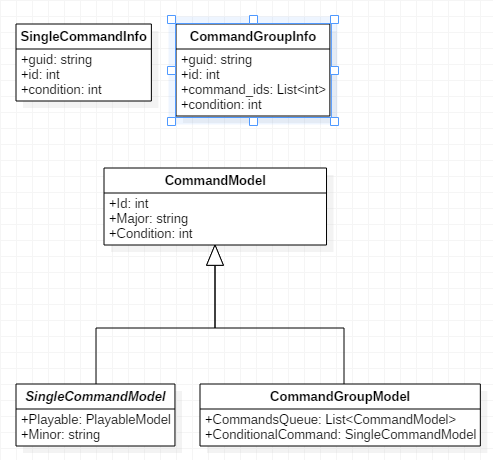

# MapEditor

## 현재 타일과 오브젝트 Json 구성
 >
    {
        "ListOfBoxData": 
        [
            {
                "Name": "Tile_Start",
                "Position": {},
                "Scale": {},
                "Quaternion": {},
                "Start": true,
                "Traversable": true,
                "Contaminated": false,
                "WarpId": null,
                "CountOfUpper": 0,
                "End": false,
            },
        ],
    "ListOfObjectData": 
        [
            {
                "Name": ,
                "Position": {},
                "Scale": {},
                "Quaternion": {},
            },
        ]
    }
>

### *문제점*

1. 그래프의 이웃노드를 추가할 때 position 값을 검사해서 느림.   검사하기 위해 순환을 해야함.    
2. 타일에는 블필요한 정보가 저장되어 있음.
    - 타일: position, scale, quaternion, countofupper, traversable? contaminated?, warpid?
    - 오브젝트: scale
3. 타일과 오브젝트를 나눠 표현할 필요가 있을까?

 

### *어떻게 해결할 것인가?*

1. id값 저장
    - id값: 포지션 값 x, y, z가 1000을 넘지 않을 것으로 예상됨.   int형 변수의 1 ~ 10비트에 x값, 11 ~ 20비트에 y값, 21 ~ 30비트에 z값 저장.    

2. scale값
    - scale(bounding size)는 클라이언트 내에서 알아 낼 수 있음.
    
3. traversable, contaminated(polluted).
    - 속성정보나 클라이언트 내에서 알아 낼 수 잇음.

3. warpid의 필요성.
    - 클라이언트 내에서 이웃노드를 추가할 수 있음.
    
4. start, end 자료 불필요.

 

### 결과
>
    "퍼즐 오브젝트":   
    [
        {
            "name": "",     // 프리팹 이름.            
            "id": "",       // id값.
            "type": ""      // 속성 string.
            "rotation": ""  // 회전값.
        },
    ]
>

 

### 오브젝트의 종류 (게임의 재미를 위해 추가 될수도 있는 종류들 포함)

- 정적: 움직이지 않고 가만히 있는 오브젝트.
- 동적: 움직이는 오브젝트.
    - 순찰: 특정 범위을 순찰. 해당 오브젝트가 있는 타일은 지나가지 못하거나 HP 감소. (동기화?)
    - 랜덤: 랜덤으로 움직임. (프로그래밍이랑 아무 상관없다.)
- 액션 
    - 오염: 하나 이상의 범위를 오염시키는 오브젝트.
    - 공격: 하나 이상의 범위를 공겨하는 오브젝트. 해당 범위 내에 로봇이 갈 경우 HP 감소.

 

### 오브젝트별 저장해야할 목록

- 공통(정적): name, 시작위치, 시작회전값
- 동적
    - 순찰: 순찰 범위 (x축, y축)
    - 랜덤: 저장할값 없음.
- 액션
    - 공격: 공격 범위
    - 오염: 오염 범위

- 문제점
    1. 맵에디터에 추가해야 할 기능이 늘어난다.
    2. 저장해야할 값이 늘어난다.
    3. 플레이어가 해당 오브젝트가 어떻게 동작하는지 알 수 없다. 
       (공격 오브젝트가 하나의 노드만 공격하는지 여러 범위를 공격하는지)

- 모델(ECS에서 Component)을 만들고 오브젝트마다 해당 모델을 저장하는 방식이 좋아보인다.

### 속성 종류

1. Playable    
2. Tile
3. Warpable
4. Cleanable

### 속성정보 특성

1. 한 오브젝트에 여러가지 속성이 부여될 수 있음.   (GameObject에 여러가지 Model 컴포넌트가 붙을 수 있음.)
2. 속성관리를 어떻게 할 것인가.
    - 클라이언트에서 새로운 속성이 추가되면 웹 서버에 저장한다.
    - 속성이 5개일 때 오브젝트에 추가될 속성의 경우의 수는 2^n 개임.

### Static 정보를 어떻게 저장할 것인가?

1. C# Reflection 기능을 이용.
2. Unity에서 string을 이용해서 컴포넌트를 붙일 수 있음.

### 기능 제한

1. 정적 물체(타일, 나무 등)에 Command를 추가할 수 있게 할 것인가?
2. 동적 물체가 될수 있는 것들(시추기, 캐릭터)에 속성을 추가할 수 있게 할 것인가?

- 만약 제한을 하게 된다면 Tag값을 이용.

# Robot Customizing

## 파츠

### 현재 Json 구성
>
    "Parts":
    [
        {
            "Name": "",      // 로봇 프리팹
            "ColorA": {},    // Color1
            "ColorB": {},    // Color2
            "ColorC": {},    // Color3
            "Position": {},  // OffsetPosition
            "Scale": {},     // Scale
            "Rotation": {},  // Rotation
        }
    ]
>

### *문제점*

- 불필요한 정보인 Roatation 저장하고 있음.
- Position 정보  각 오브젝트 마다 Mesh가 달라서 파츠를 변경할때마다 오프셋 시켜줘야함.  스케일이 변경될때 마다 오프셋 값도 변경됨.

### *어떻게 해결할 것인가?*

- Rotation 정보 삭제
- Position 정보 삭제

>
    "parts": 
    [
        {
            "name": "",       // 메쉬 이름.
            "color_A": {},    // Color1
            "color_B": {},    // Color2
            "color_C": {},    // Color3
            "scale": {},      // Scale;
        }
    ]
>

 

## 스티커
>
    {
        "ParentName": "",        
        "BoneName": "",
        "GParentName": "",
        "Name": "",
        "BufVertices": [{},],
        "BufIndices": [{},],
        "BufNormals": [{},],
        "Position": {},
        "Rotation": {}
    }
>

### *문제점*
- 파츠 프리팹을 여러개 생성하고 있음.  
  파츠가 움직일 때 스티커도 같이 움직어야 하므로 파츠 이름과 파츠 안에 있는 본 이름도 저장하고 있음.   파츠를 미리 여러개 생성해고 있으므로 인덱스로 구분을 해놓음. 결과적으로 불필요한 정보가 생김.

### *어떻게 해결할 것인가?*

1. 각 파츠의 메쉬를 프로토타입 정보로 만들어 놓음.
2. 뼈대와 각각 각 메쉬를 하위 노드로 갖고있는 프리팹을 만들어놓음.  (오프셋을 위한 노드도 포함.)
3. 로봇을 만들때마다 프리팹을 로드하고 각 UI에 상응하는 메쉬를 프로토타입에서 골라서 넣어줌. (UniRx를 이용)

### 결과

- 파츠마다 프리팹을 만들필요가 없다.
- 저장해야 할 정보다 줄어든다.
- 코드 이해하기가 쉬워짐.

>
    {
        "bone_name": "",    // 뼈대 이름
        "name": "",         // 스티커 이름
        "vertices": [{},]   // 버텍스
        "indices": [{},]    // 인덱스
        "normals": [{},]    // 법선
        "position": {}      // 위치
        "rotation": {}      // 회전
    }
>

## Command정보 저장.

- Playable(커맨드에 의해 움직여지는 오브젝트)들의 커맨들 정보를 저장해야함.
- static 정보
    1. Major: prefab으로 부터 얻어올 수 있음.
    2. Minor: prefab으로 부터 얻어올 수 있음.

- dynamic 정보
    1. id
    2. condition
    3. command list (CommandGroupModel의 경우)

### SingleCommand (Action, Move, Jump, Turn 등)

>
    {        
        "name": ""      // 프리팹의 name
        "id": "",       // 커맨드의 id
        "condition": "" // 커맨드의 상태(조건, 현재는 색상.)
    }
>

### CommandGroup: SingleCommand와 CommandGroup을 보관하는 그룹.

>
    {
        "name": ""              // 프리팹의 name
        "id": ""                // 커맨드 그룹의 id
        "command_ids" [ "", ]   // 보관하고 있는 커맨드의 id값. 0번째는
        "condition": ""         // 커맨드 그룹의 상태.
    }
>

- command_ids의 0번째 값은 CommandGroupModel의 ConditionalCommand임.