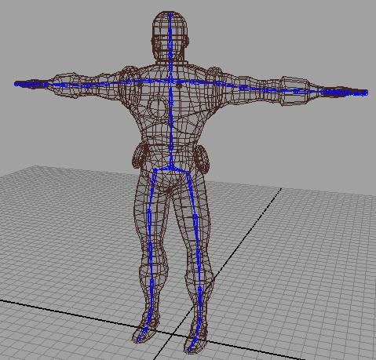
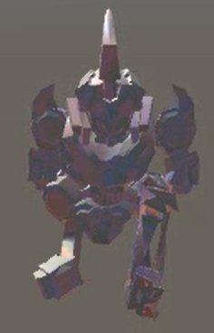
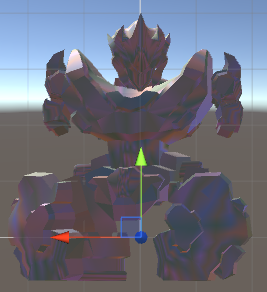
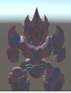
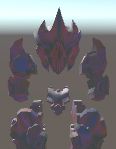

# 뼈대 애니메이션

메쉬의 정점이 연결된 뼈대에 따라 움직임.
>
    정점위치 = vertex.position * offset_matrix * bone.matrix;
    offset_matrix: 정점 local space에서 bone local space 로 변환하기 위한 행렬
    bone.matrix: 뼈대 행렬.
>
 

- 뼈대를 공유하는 이유
    - refactoring_inwon(브런치)/work/refactoring_3dbot.md 내용 참조.

- 뼈대 공유시 문제점 및 원인
    - 머리부분을 제외한 다른 부분의 파츠를 변경시(메쉬 변경시) 메쉬가 깨지는 현상 발생.

    

    - 파츠마다 연결된 뼈대가 다른 것으로 예상.

- 해결
    - 파츠가 변경될때마다 뼈대를 연결해주는 작업 수행.

- 추가 문제점.
    - 뼈대의 크기를 변경할때 파츠마다 연결된 뼈대가 다름으로 인한 문제 발생.
        
        

    - scale을 변경할 시 뼈대가 1개이기 때문에 mesh에 곱해줘야함. 
      SkinnedMeshRenderer.sharedMesh.bindpose 값을 변경하면 될 것 같다.  
      30개의 뼈대에 대해 곱해줘야함... 
      (각각 파츠별로 애니메이션 연산하는거에 비하면 적음.)        
      파츠를 변경할때 메쉬 크기 차이로 발생하는 빈 공간을 없애기 위해 position조정을 해야함.  
      파츠마다 부모 오브젝트와 뼈대가 있어서 가능했는데 새로운 방법을 찾아 봐야함.  
      메쉬를 키우는 것으로 해결

- Scale조정할때 메쉬를 키우므로서 발생하는 문제점.
    1. 각 파츠마다 메쉬의 크기가 달라서 파츠를 변경할 시에 제대로 적용이 안됨.
        - 모델의 메쉬 크기 맞추기, 트랜스폼값 동일하게 마추는 작업 필요.
        - 메쉬의 크기를 통일하기 위해 bindpose값을 통일 시켜보았으나 변경되지 않음.

        
        