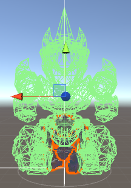
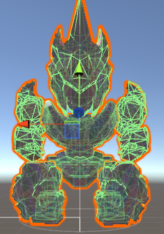

- 기존에 박스 콜리더로 스티커를 부치는 작없을 했었는데 메쉬와 콜리더의 오프셋의 크기가 메쉬를 생성할 경계박스 보다 크면 스티커를 생성하지 못함. 
Mesh Collider를 이용해야함.
- 뼈대와 메쉬 크기가 달라서 메쉬 콜라이더 생성시 사이즈 크기 발생함.

  

- 비어있는 애니메이션을 만들어서 뼈대의 크기를 조절함.
- 다른 애니메이션 적용시 로봇이 작아짐. 
  로봇을 키우거나 렌더오브젝트의 크기를 줄이는 것으로 해결 가능함. 
  뼈대에 크기 매트릭스를 곱해줘도 가능한데 크기를 키우는 것이 연산이 적다.
- 파츠를 변경할때마다 메쉬콜라이더의 sharedMesh값을 변경해줘야함.
- 파츠 크기를 조절할때마다 메쉬콜라이더의 sharedMesh bindPose 값을 변경해야 함.  
  크기 변경시 파츠 사이에 공간만큼 포지션값 조정이 필요함.

